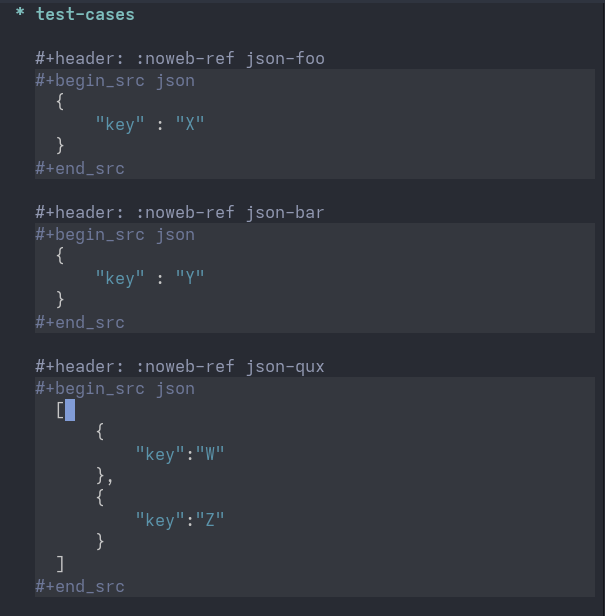
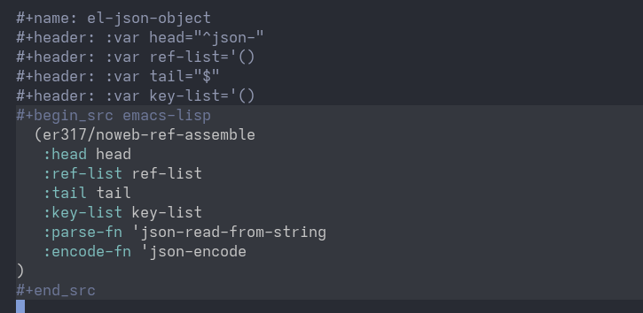
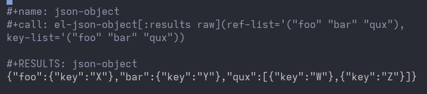

# Persemacs

This repository contains Emacs development by Erwann Rogard.

## Description

- Directory [`./org/`](./org/) contains Org mode meta-code.
- All other directories are intended to contain code generated from the Org files.
- Emacs configuration starts with [`./org/init.org`](./org/init.org)
- Extensions are in [`./org/extension`](./org/extension.org)

## Highlights

### noweb-ref-\<feature\>
This extension hooks into the backend of [Org's noweb reference](https://orgmode.org/manual/Noweb-Reference-Syntax.html) to provide Emacs Lisp functionality for *assembling* source blocks. This allows for more complex transformations of referenced source blocks than Org alone.

#### Assemble JSON blocks

  
Click to open

The test cases are manually defined JSON blocks of various types, each assigned a `noweb-ref` (the mapping is not necessarily one-to-one). Then, a manually defined Emacs Lisp source block is used to pass `ref-list` and `ref-keys`—where each key is matched with a block returned by `ref-list`—as input to `er317/noweb-ref-assemble`. Upon evaluation, a compact JSON object is returned. The complete example in the source code also shows how to pretty-print the resulting JSON and post-process it by wrapping it in a source block with a `noweb-ref` header. By omitting `:key-list` and replacing `:encode-fn`'s value with `'json-encode-array`, the same setup returns a JSON array.

##### Test cases

##### Assembler

##### Evaluate

<!-- TODO 
- Generate this file using Org+Export 
- Figure out how to emulate github display on local machine
-->

